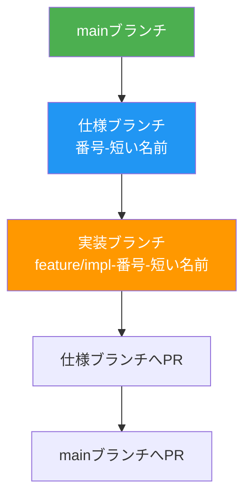

# アンモニア在庫予測ダッシュボード プロジェクト憲法

## コア原則（非交渉的）

### I. テスト駆動開発の徹底

**原則**:
- 全機能実装前にテストコードを作成し、仕様に対する検証を必須とする
- Red-Green-Refactorサイクルを厳格に遵守する
  1. テストを書く（Red: 失敗することを確認）
  2. ユーザー承認を得る
  3. 最小限の実装で合格させる（Green）
  4. リファクタリング（品質向上）
- E2Eテストは100%正常動作するまで繰り返し修正する

**根拠**: テストファーストにより仕様の曖昧性を早期発見し、実装品質を保証する。後付けテストは仕様漏れを見逃すリスクが高い。

### II. セキュリティ要件の最優先

**原則**:
- セキュリティ要件は機能要件より常に優先される
- 機密データ（APIキー、認証情報）の平文保存を禁止する
- 全機密情報は暗号化またはハッシュ化して管理する
- 環境変数（`.env`）はリポジトリに含めず、`.gitignore`で除外する

**根拠**: セキュリティ侵害は全ての機能価値を無効化する。予防的措置が事後対応より低コストで効果的。

### III. パフォーマンス閾値の定量化

**原則**:
- 全パフォーマンス要件を定量的指標で定義する
- 受入基準にパフォーマンス閾値を組み込む
  - ページ読み込み: 3秒以内
  - APIレスポンス: 500ms以内（95パーセンタイル）
  - AI予測実行: 30秒以内（ローカル環境）
  - ビルド時間: 5分以内（GitHub Actions）
- 閾値を超える場合は実装前に最適化戦略を検討する

**根拠**: 定量化なしでは品質判断が主観的になり、後からの改善が困難。ユーザー体験の一貫性を保証する。

### IV. データ整合性の確保

**原則**:
- 全データソースに単一の正本（Source of Truth）を定める
  - 学習データ正本: `backend/ai_pipeline/data/training_data.csv`
  - 予測データ正本: `backend/ai_pipeline/data/predictions.csv`
- データ変更は必ずバージョン管理（Git）で追跡する
- 欠損データは自動補完ロジック（前年同日コピー）で透明性を保つ
- 手動変更はコミットメッセージで変更理由を明記する

**根拠**: データの信頼性がAI予測精度の基盤。複数コピーの同期ずれは致命的エラーの原因となる。

### V. 完全自動化と再現性

**原則**:
- 手作業を必要とする手順を排除し、完全自動化を目指す
- GitHub Actionsで以下を自動実行:
  - 毎日JST 07:00のデータ更新・予測・デプロイ
  - mainブランチへのプッシュ時の即時ビルド・デプロイ
  - デプロイ失敗時のIssue自動作成
- 外部依存は`package.json`および`requirements.txt`でバージョン固定し、再現性を確保する
- ローカル開発環境とCI環境で同一のビルド手順を使用する

**根拠**: 手作業は人為的ミスとドキュメント乖離の原因。自動化により品質の一貫性と運用コストを削減する。

## 品質基準

### コード品質

- **型安全性**: TypeScriptの厳格モード（`strict: true`）を使用し、型エラーをゼロにする
- **Linting**: ESLintルールに準拠し、警告をゼロにする
- **コードレビュー**: 重大変更（セキュリティ、API変更、データモデル変更）は必ずレビュー承認を得る
- **文字エンコーディング**: 全ファイルをUTF-8で保存し、文字化けを防止する

### テスト基準

- **カバレッジ**: E2Eテストで主要ユーザーフローを100%カバーする
- **継続的検証**: ローカルビルドとGitHub Actionsで同一テストを実行する
- **テスト環境**: Playwrightを使用したブラウザテスト（Chromium、Firefox、WebKit対応）

### ユーザー体験

- **レスポンシブデザイン**: モバイル、タブレット、デスクトップで一貫した体験を提供する
- **アクセシビリティ**: ダークモード対応、視認性の高いUIカラースキーム
- **エラーハンドリング**: 全エラーを適切にキャッチし、ユーザーにわかりやすいメッセージを表示する

## セキュリティと制約

### セキュリティ要件

- **機密データ保護**:
  - 環境変数（`.env`）はリポジトリに含めない
  - APIキーは環境変数またはGitHub Secretsで管理
  - パスワードは平文保存禁止（ハッシュ化必須）
- **HTTPS通信**: GitHub Pagesは自動的にHTTPSを提供
- **依存関係の監査**: `npm audit`でセキュリティ脆弱性を定期チェック

### 技術的制約

- **Node.js**: 20.x以上（GitHub Actions標準）
- **Python**: 3.10.11（標準実行環境）、実行コマンドは`py -3.10`を使用
- **外部依存のバージョン固定**:
  - Next.js: 14.x
  - React: 18.x
  - Chart.js: 4.4.x
  - scikit-learn（Python）: requirements.txtで固定
- **ブラウザサポート**: モダンブラウザ（Chrome、Firefox、Safari、Edge最新版）

### 運用制約

- **GitHub Pages制約**:
  - 静的サイトのみ（サーバーサイド実行不可）
  - 学習・予測・インポート機能はローカル環境（localhost）専用
  - GitHub Pages上では機能無効化と警告表示を実装
- **データ更新フロー**:
  - ローカルでCSVインポート → コミット＆プッシュ → GitHub Actions自動実行
  - GitHub ActionsをローカルAPIから直接トリガー不可（GitHub制約）

## 開発ワークフロー

### ブランチ戦略



**手順**:

1. **仕様ブランチ作成**（mainから派生）:
   ```bash
   git checkout main
   git checkout -b 001-ammonia-forecast
   ```

2. **実装ブランチ作成**（仕様ブランチから派生）:
   ```bash
   git checkout 001-ammonia-forecast
   git checkout -b feature/impl-001-ammonia-forecast
   ```

3. **マージフロー**:
   - 実装完了 → 仕様ブランチへPR → レビュー承認 → マージ
   - 仕様確定 → mainブランチへPR → 最終承認 → マージ

### 作業順序（厳守）


1. **憲法**: プロジェクト原則の確立（このドキュメント）
2. **仕様**: 要件定義とユーザーストーリー（`spec.md`）
3. **計画**: 技術設計とアーキテクチャ（`plan.md`）
4. **タスク**: 実装タスクの詳細化（`tasks.md`）
5. **検証**: テストコード作成（失敗確認）
6. **実装**: 最小限のコードで合格
7. **レビュー**: コード品質とセキュリティ確認
8. **デプロイ**: GitHub Actions自動デプロイ

### ドキュメント管理

- **Mermaid図**: v11準拠を厳守
  - 日本語対応: `flowchart`、`graph`、`sequenceDiagram`、`stateDiagram-v2`を使用
  - `gitGraph`は日本語非対応のため使用禁止
  - ブランチ戦略は`flowchart TB + subgraph`で表現
- **文字化け対策**: UTF-8エンコーディングを徹底
- **英語テンプレート削除**: テンプレートから生成したドキュメントの英語部分を確実に削除

### 品質ゲート

- **実装前**:
  - [ ] 憲法チェック通過（Constitution Check in plan.md）
  - [ ] テストコード作成済み（失敗確認）
  - [ ] ユーザー承認取得
- **実装後**:
  - [ ] 全テスト合格（E2E含む）
  - [ ] Lintエラーゼロ
  - [ ] ビルド成功（`npm run build`）
  - [ ] ローカルプレビュー確認
  - [ ] セキュリティチェック（`npm audit`）
- **デプロイ前**:
  - [ ] GitHub Actions成功
  - [ ] GitHub Pages動作確認
  - [ ] パフォーマンス閾値クリア

## ガバナンス

### 憲法の優先順位

この憲法は全てのプロジェクトプラクティスに優先される。憲法との矛盾が発生した場合、憲法の原則に従う。

### 改訂プロセス

1. **提案**: 改訂理由と影響範囲を明記したIssueを作成
2. **レビュー**: 全開発者による検討（最低3営業日）
3. **承認**: 全員合意で承認
4. **バージョン更新**: セマンティックバージョニングに従う
   - MAJOR: 後方互換性のない原則削除・再定義
   - MINOR: 新原則追加、セクション拡張
   - PATCH: 文言明確化、誤記修正
5. **移行計画**: 既存コードへの影響を評価し、移行手順を文書化

### 複雑性の正当化

憲法チェック（Constitution Check）で違反が検出された場合、以下を文書化する:

| 違反項目 | 必要な理由 | 却下された代替案とその理由 |
|---------|-----------|-------------------------|
| 例: 4番目のプロジェクト追加 | 現在のニーズ詳細 | なぜ3プロジェクトで不十分か |

### 実行時ガイダンス

- 開発中の判断は本憲法を基準とする
- テンプレート（`plan-template.md`、`spec-template.md`、`tasks-template.md`）は憲法原則に準拠する
- 全PR/レビューで憲法準拠を検証する

**Version**: 1.0.0 | **Ratified**: 2025-12-05
