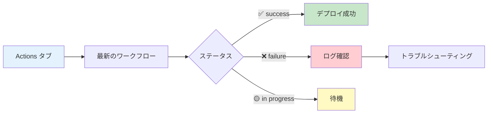
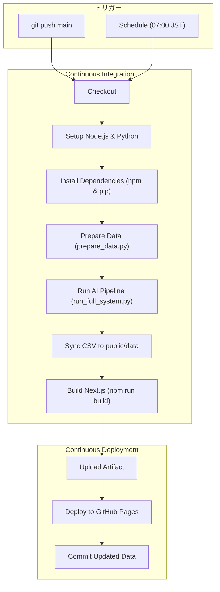
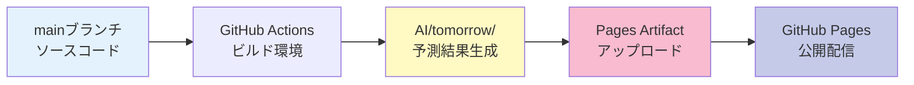

# アンモニア在庫レベル予測ダッシュボード - GitHub Pages デプロイ完全ガイド

アンモニア在庫レベル予測ダッシュボードを GitHub Pages で本番運用するための完全なデプロイガイドです。

**バージョン**: 1.0.0  
**最終更新**: 2025年12月5日  
**ステータス**: ✅ GitHub Actions ワークフロー完全対応  
**公開URL**: https://j1921604.github.io/ammonia_inventory_forecast/  
**Actions**: https://github.com/J1921604/ammonia_inventory_forecast/actions  
**リポジトリ**: https://github.com/J1921604/ammonia_inventory_forecast

---

## 📋 目次

1. [システム概要](#システム概要)
2. [⚠️ 重要: デプロイ方式の選択](#重要-デプロイ方式の選択)
3. [デプロイに必要なファイル](#デプロイに必要なファイル)
4. [前提条件](#前提条件)
5. [クイックスタート](#クイックスタート)
6. [GitHub Pagesへのデプロイ](#github-pagesへのデプロイ)
7. [Vercelへのデプロイ](#vercelへのデプロイ)
8. [ローカル開発環境のセットアップ](#ローカル開発環境のセットアップ)
9. [データ更新手順](#データ更新手順)
10. [自動デプロイ（GitHub Actions）](#自動デプロイgithub-actions)
11. [GitHub Pages設定](#github-pages設定)
12. [トラブルシューティング](#トラブルシューティング)
13. [デプロイ前チェックリスト](#デプロイ前チェックリスト)

---

---

## デプロイに必要なファイル

### ✅ 必須ファイル（必ずアップロード）

```
ammonia_inventory_forecast/        ← リポジトリ名
│
├── .github/
│   └── workflows/
│       └── deploy-pages.yml      ← GitHub Pages自動デプロイ
│
├── backend/
│   └── ai_pipeline/              ← Python製 AI パイプライン（GitHub Actions / API で使用）
│
├── app/
│   ├── api/                      ← APIルート
│   ├── layout.tsx                ← ルートレイアウト
│   ├── page.tsx                  ← メインダッシュボード
│   └── globals.css               ← スタイル
│
├── public/
│   └── data/
│       └── predictions.csv       ← 予測データ
│
├── docs/
│   ├── DEPLOY_GUIDE.md           ← このファイル
│   └── 完全仕様書.md              ← 完全仕様書
│
├── .gitignore                    ← Git除外設定
├── next.config.js                ← Next.js設定
├── package.json                  ← 依存関係
├── package-lock.json             ← 依存関係ロックファイル(必須)
├── tsconfig.json                 ← TypeScript設定
└── README.md                     ← プロジェクト説明
```

**合計**: 約15ファイル

### ❌ デプロイ不要なファイル（コピーしない・削除する）

| ファイル/フォルダ | 不要な理由 |
|---|---|
| `.next/` | ビルドキャッシュ。デプロイ先で自動生成される |
| `node_modules/` | npmパッケージ。`package.json`から自動インストールされる(200MB超) |
| `out/` | 静的エクスポート出力。GitHub Actionsが自動生成 |
| `next-env.d.ts` | TypeScript型定義。Next.jsが自動生成 |

---

## 前提条件

### 必要なアカウント
- GitHubアカウント（https://github.com/）
  - リポジトリ: `J1921604/ammonia_inventory_forecast`
- Vercelアカウント（https://vercel.com/）※Vercelにデプロイする場合のみ

### ローカル環境（ローカルテストする場合のみ）
- Node.js 20.x 以上
- Git

---

## ⚠️ 重要: デプロイ方式の選択

### GitHub Pages には2つのデプロイ方式があります

本プロジェクトは **GitHub Actions（Source）** 方式を使用します。

| デプロイ方式                       | 説明                                           | 本プロジェクトでの適用                     |
| ---------------------------------- | ---------------------------------------------- | ------------------------------------------ |
| **GitHub Actions（Source）** | GitHub Actions ワークフローからデプロイ        | ✅**正しい設定**                     |
| **Deploy from a branch**     | ブランチから直接デプロイ（静的コンテンツ専用） | ❌**このプロジェクトでは使用しない** |

### なぜ GitHub Actions（Source）設定が正しいか

本プロジェクトは Next.js アプリケーションであり、以下の処理が必要です：

1. **Node.js 環境のセットアップ**
2. **npm パッケージのインストール** (`npm ci`)
3. **Python AIパイプラインの実行** (`backend/ai_pipeline/src/run_full_system.py`)
   - 前年同日コピー / 1か月先予測を一括処理
4. **Next.js のビルド** (`npm run build` - output: 'export'設定により静的ファイルが自動生成)
5. **生成された静的ファイルのデプロイ**

これらの処理は **GitHub Actions ランナー上で実行**され、生成された静的ファイル（HTML、CSS、JS、画像）が Pages に配信されます。

**重要**:

- `Settings → Pages → Source: GitHub Actions` に設定すると、ワークフローの `actions/deploy-pages@v4` ステップが成果物をデプロイ
- `.github/workflows/deploy.yml` の `schedule` トリガーにより、**毎日 JST 07:00 に自動でビルド・デプロイが実行される**（手動操作不要）

### ✅ GitHub Actions（Source）が正しく動作する理由

`Source: GitHub Actions` を選択すると、以下のように動作します：

| 動作                                      | 説明                                                | 結果                          |
| ----------------------------------------- | --------------------------------------------------- | ----------------------------- |
| **Push トリガーでワークフロー実行** | `.github/workflows/deploy.yml` が自動実行 | Next.js ビルドが実行される |
| **predictions.csv が自動補完される**   | Pythonパイプライン（学習→予測）が実行される    | 前年同日データ + 1か月先予測が反映    |
| **静的ファイルが生成される**          | `npm run build && npx next export` が実行される                      | out/ ディレクトリに HTML/CSS/JS 生成 |
| **毎日の自動更新が可能**            | Cron トリガーが有効                                 | JST 07:00 に自動実行          |
| **GitHub Pages に自動デプロイ**     | `actions/deploy-pages@v4` が成果物をデプロイ      | サイトが自動更新              |

### ✅ GitHub Actions + ワークフロー実行の利点

| 利点                     | 説明                                           |
| ------------------------ | ---------------------------------------------- |
| **完全自動化**     | 毎日 JST 07:00 に自動でビルド・デプロイ                |
| **データ自動補完** | 前年同日データで自動的にギャップを埋める              |
| **静的サイト生成**       | Next.js が最適化された HTML を自動生成 |
| **エラー監視**       | デプロイ失敗時に自動で Issue 作成              |
| **リポジトリ同期** | 更新されたデータを自動コミット・プッシュ               |

---

## システム概要

### アーキテクチャ

アンモニア在庫レベル予測ダッシュボードは、Next.js 14 (App Router) で構築された静的サイト生成(SSG)アプリケーションです。

**技術スタック**:
- **Next.js 14** (App Router)
- **TypeScript**
- **React 18**
- **Chart.js 4.4.1** + react-chartjs-2 5.2.0

**デプロイ先**:
- GitHub Pages（メイン）
- Vercel（オプション）

### ワークフロー

本プロジェクトでは**`.github/workflows/deploy.yml`**を使用します。

| ワークフロー                                       | 用途                                | ステータス             |
| -------------------------------------------------- | ----------------------------------- | ---------------------- |
| **`.github/workflows/deploy.yml`** | **ammonia_inventory_forecast専用** | ✅**アクティブ** |

- Next.js ビルド、静的エクスポート、自動デプロイを実行
- 毎日JST 07:00に自動実行（UTC 22:00 Cron）
- mainブランチへのPush時にも実行
- predictions.csv データ自動補完機能
- エラー時 GitHub Issue 自動作成

```
毎日 JST 07:00 (GitHub Actions Cron)
↓
predictions.csv データチェック
↓
前日までのデータが無い場合、前年同日からコピー
↓
Next.js ビルド (npm run build - 静的ファイルがoutディレクトリへ自動生成)
↓
GitHub Pages 自動デプロイ
↓
更新された predictions.csv をリポジトリにコミット
```

---

## 🚀 クイックスタート

### 前提条件

- ✅ Node.js 20.x インストール済み
- ✅ npm インストール済み
- ✅ Git インストール済み
- ✅ GitHubアカウント作成済み

### 5分でデプロイ

#### ステップ1: リポジトリクローン

```bash
git clone https://github.com/J1921604/ammonia_inventory_forecast.git
cd ammonia_inventory_forecast
```

#### ステップ2: Node.js 環境セットアップ

```bash
# 依存パッケージインストール
npm install
```

#### ステップ3: ローカルダッシュボード起動（オプション）

```bash
# 開発サーバー起動
npm run dev

# ブラウザで http://localhost:3000 を開く
```

#### ステップ4: 動作確認（ローカル）

```bash
# 本番ビルドテスト
npm run build

# 静的エクスポート
npx next export

# プロジェクトルートに戻る
cd ..

# 静的ファイルプレビュー
python -m http.server 8080 --directory out

# ブラウザで http://localhost:8080/ammonia_inventory_forecast/ を開く
```

#### ステップ4.1: AIパイプライン実行（任意）

```bash
cd backend/ai_pipeline
python -m pip install --upgrade pip
pip install -r requirements.txt
python src/run_full_system.py  # 学習→予測
```

> API ルートや GitHub Actions から Python を呼ぶ際にカスタム実行ファイルが必要な場合は、`PYTHON_EXECUTABLE` 環境変数を設定してください。

#### ステップ5: GitHub Pages 設定（初回のみ必須）

**✅ 正しい設定**: `GitHub Actions` を選択してください。

1. リポジトリの **Settings** → **Pages** を開く
2. **Source** のドロップダウンで「**GitHub Actions**」を選択
3. **Save** をクリック

**確認方法**:

```
Settings → Pages → Source: GitHub Actions
```

**❌ 間違った設定例**:

```
Source: Deploy from a branch
```

→ この設定では GitHub Actions ワークフローからの自動デプロイが機能しません。

#### ステップ6: ワークフロー手動実行（任意）

**注意**: ワークフローは毎日 JST 07:00 に **Cron トリガーで自動実行**されるため、手動実行は任意です。初回デプロイ直後に動作確認したい場合のみ実行してください。

1. https://github.com/J1921604/ammonia_inventory_forecast/actions を開く
2. 左側メニューから「**Deploy Ammonia Inventory Forecast to GitHub Pages**」を選択
3. 右上の「**Run workflow**」ボタンをクリック
4. ブランチ「**main**」を確認して「**Run workflow**」をクリック
5. ワークフローが開始されるまで数秒待つ

**または**: コードをプッシュしてトリガー

```bash
# mainブランチへプッシュ
git checkout main
git pull origin main
git add .
git commit -m "deploy: Initial release"
git push origin main
```

#### ステップ7: GitHub Actions確認

1. https://github.com/J1921604/ammonia_inventory_forecast/actions を開く
2. 「Deploy Ammonia Inventory Forecast to GitHub Pages」ワークフロー実行を確認
3. ✅ All jobs succeeded になるまで待つ(約3-5分)

#### ステップ8: 公開サイトアクセス

```
https://j1921604.github.io/ammonia_inventory_forecast/
```

✅ ダッシュボードが表示され、チャートとデータが正常に動作すれば成功!

---

---

## GitHub Pagesへのデプロイ

### ステップ1: デプロイ用ファイルの準備

リポジトリのルートディレクトリに以下のファイルが含まれていることを確認：

- ✅ `.github/workflows/deploy.yml` がある
- ✅ `app/page.tsx` がある
- ✅ `backend/ai_pipeline/data/predictions.csv` がある
- ✅ `package.json` がある
- ✅ `package-lock.json` がある
- ❌ `node_modules` フォルダがない
- ❌ `.next` フォルダがない

### ステップ2: GitHubリポジトリの確認

リポジトリURL: https://github.com/J1921604/ammonia_inventory_forecast

すでにリポジトリは作成済みです。新しくクローンする場合：

```bash
git clone https://github.com/J1921604/ammonia_inventory_forecast.git
cd ammonia_inventory_forecast
```

### ステップ3: ローカルファイルをGitHubにプッシュ

変更をコミットしてプッシュ：

```bash
# 変更をステージング
git add .

# コミット
git commit -m "Update dashboard for deployment"

# プッシュ
git push origin main
```

**プッシュ後の確認**

ブラウザで https://github.com/J1921604/ammonia_inventory_forecast を開き、確認：
- ✅ `app` フォルダが存在する
- ✅ `backend/ai_pipeline/data/predictions.csv` が存在する
- ✅ `package.json` が存在する
- ✅ `.github/workflows/deploy.yml` が存在する

### ステップ4: GitHub Pagesの有効化

1. **リポジトリ設定にアクセス**
   - https://github.com/J1921604/ammonia_inventory_forecast
   - 「Settings」タブをクリック

2. **Pagesを設定**
   - 左メニューから「Pages」を選択
   - Source: **「GitHub Actions」を選択**
   - Save

3. **自動デプロイの開始**
   - 「Actions」タブをクリック
   - 「Deploy Ammonia Inventory Forecast to GitHub Pages」ワークフローが自動実行される
   - 緑のチェックマークが表示されれば成功

4. **デプロイされたサイトにアクセス**
   - 約3-5分後にアクセス可能
   - URL: `https://j1921604.github.io/ammonia_inventory_forecast/`

---

## Vercelへのデプロイ

### 方法1: Vercel CLI（推奨）

1. **Vercel CLIのインストール**

```powershell
npm install -g vercel
```

2. **ログイン**

```powershell
vercel login
```

3. **デプロイ先フォルダに移動**

```powershell
cd ammonia_inventory_forecast/src
```

4. **初回デプロイ**

```powershell
vercel
```

質問に答える:
- Set up and deploy: `Y`
- Which scope: 自分のアカウントを選択
- Link to existing project: `N`
- Project name: `ammonia-inventory-forecast`
- In which directory: `./` (そのままEnter)
- Override settings: `N`

5. **本番環境にデプロイ**

```powershell
vercel --prod
```

6. **デプロイされたサイトにアクセス**
   - URL: `https://ammonia-inventory-forecast.vercel.app`
   - または表示されたURLをブラウザで開く

### 方法2: Vercel Webダッシュボード

1. **Vercelにログイン**
   - https://vercel.com にアクセス

2. **GitHubリポジトリをインポート**
   - 「Add New」→「Project」をクリック
   - 「Import Git Repository」を選択
   - `J1921604/ammonia_inventory_forecast` を検索して選択
   - 「Import」をクリック

3. **プロジェクト設定**
   - Framework Preset: **Next.js**（自動検出される）
   - Root Directory: `src`（**重要**: srcディレクトリを指定）
   - Build Command: `npm run build`（デフォルト）
   - Output Directory: `.next`（デフォルト）
   - 「Deploy」をクリック

4. **デプロイ完了**
   - 約2-3分で完了
   - URLが表示される

---

## ローカル開発環境のセットアップ

ローカルでテストする場合のみ実行：

### 1. 依存関係のインストール

```powershell
# srcディレクトリに移動
cd ammonia_inventory_forecast/src

# npmパッケージをインストール
npm install
```

**所要時間**: 約2-5分  
**インストールされるパッケージ**: 約300個（約200-300MB）

### 2. 開発サーバーの起動

```powershell
npm run dev
```

ブラウザで http://localhost:3000 にアクセス

### 3. ビルドテスト（オプション）

```powershell
# 本番ビルド
npm run build

# 静的エクスポート
npx next export
```

**ビルド結果**:
- `.next/` フォルダに最適化ファイルが生成される
- `out/` フォルダに静的HTMLが生成される

**注意**: これらのフォルダ（`.next`、`out`）はGitにコミットする必要はありません（`.gitignore`で除外済み）

---

## データ更新手順

### training_data.csv を更新する場合

1. **ローカルで CSV を準備**
   - 列構成: `date,actual_power,actual_ammonia,...`
   - 欠損日があっても可（後続で `prepare_data.py` が補完）
2. **ダッシュボードの「インポート」ボタン**または `POST /api/data/import` にファイルを送信
   - ファイルは `backend/ai_pipeline/data/training_data.csv` に保存され、直後に `src/prepare_data.py` が実行されます。
3. **GitHub Actions を走らせる**
   - `git add backend/ai_pipeline/data/training_data.csv`
   - `git commit -m "Update training data"`
   - `git push origin main`
   - もしくは GitHub → Actions → Deploy Workflow → **Run workflow** で手動実行
4. **CI が完了すると**、`run_full_system.py` により最新の `predictions.csv` が `backend/ai_pipeline/data` に生成され、GitHub Pages が再デプロイされます。

> 🔒 GitHub Actions はローカルAPIから直接トリガーできません。インポート後は **必ずコミット＆プッシュ** するか、GitHub の Actions 画面で手動実行してください。

### predictions.csv を即時反映したい場合

ローカルで `npm run dev` を起動し、ダッシュボードの **予測** ボタンをクリックするか、`POST /api/ml/predict` を実行してください。終了後に `backend/ai_pipeline/data/predictions.csv` が更新され、リロードで反映されます。

### ダッシュボードからのインポート/エクスポート（ローカル限定）

- **インポート**: `training_data.csv` をアップロード → 自動で `prepare_data.py` 実行
- **エクスポート**: 現在の `training_data.csv` をダウンロード
- いずれも **localhost / 127.0.0.1** でのみ利用可。GitHub Pages (https://j1921604.github.io/ammonia_inventory_forecast/) では無効化されます。

---

## ⚙️ 自動デプロイ（GitHub Actions)

### ワークフローファイル

- **場所**: `.github/workflows/deploy.yml`
- **トリガー**: `push`（main）、`schedule`（JST 07:00）、`workflow_dispatch`
- **目的**: `prepare_data.py` で欠損を埋め、`run_full_system.py` で学習/予測した後、Next.js をビルドして GitHub Pages へデプロイ

```yaml
jobs:
   build-and-deploy:
      runs-on: ubuntu-latest
      steps:
         - uses: actions/checkout@v4
         - uses: actions/setup-node@v4
            with:
               node-version: '20'
               cache: 'npm'
         - uses: actions/setup-python@v5
            with:
               python-version: '3.11'
         - run: npm ci
         - name: Install Python dependencies
            working-directory: backend/ai_pipeline
            run: |
               python -m pip install --upgrade pip
               pip install -r requirements.txt
         - name: Prepare data (fill missing actuals)
            working-directory: backend/ai_pipeline
            run: python src/prepare_data.py
         - name: Train & predict
            working-directory: backend/ai_pipeline
            run: python src/run_full_system.py
         - run: npm run build
         - uses: actions/upload-pages-artifact@v3
            with:
               path: 'out'
         - uses: actions/deploy-pages@v4
         - name: Commit CSV updates
            if: success()
            run: |
               git config --local user.email "github-actions[bot]@users.noreply.github.com"
               git config --local user.name "github-actions[bot]"
               git add backend/ai_pipeline/data/predictions.csv backend/ai_pipeline/data/training_data.csv
               git diff --staged --quiet || git commit -m "chore: Update data (predictions & training) [skip ci]"
               git push
```

### 主要ステップと役割

| ステップ | 役割 |
| --- | --- |
| Setup Node / npm ci | Next.js 依存関係をインストール |
| Setup Python / pip install | AI パイプライン依存関係をインストール |
| `prepare_data.py` | 前年同日コピーで `training_data.csv` のギャップを埋める |
| `run_full_system.py` | 全データ学習 → 30日予測 |
| `npm run build` | 静的サイト生成（output: 'export'設定によりoutディレクトリへ自動生成） |
| upload/deploy-pages | GitHub Pages へ配信 |
| Commit step | 生成された CSV を main ブランチへ戻し、履歴を同期 |

### トリガーの使い分け

- `push`: `main` ブランチにコミット（例: training_data インポート後）
- `schedule`: 毎日 JST 07:00 に自動実行し、CSV を最新化
- `workflow_dispatch`: GitHub Actions 画面から手動実行（緊急時や検証用）

### 重要ポイント

#### 1. permissions設定

```yaml
permissions:
  contents: write   # 予測結果をリポジトリにコミット
  pages: write      # GitHub Pages書き込み権限
  id-token: write   # OIDC トークン発行権限
  issues: write     # R²<0.8時にIssue自動作成
```

#### 2. Python環境セットアップ

- **Python 3.10.11**: 公式アクションでインストール
- **pip cache**: 依存関係を高速インストール
- **requirements.txt**: 全依存パッケージを自動インストール
- **環境変数 AI_TARGET_YEARS**: 学習年を一括管理（デフォルト: 2022,2023,2024）

#### 3. Open-Meteo API連携

```yaml
- name: Fetch latest temperature data
  run: |
    cd AI
    python tomorrow/temp.py
```

- 最新の気温データを自動取得
- APIキー不要（Open-Meteo無料API使用）

### デプロイトリガー

以下のイベントで自動デプロイが実行されます。

| トリガー                    | 実行タイミング            | 用途                           |
| --------------------------- | ------------------------- | ------------------------------ |
| **schedule (Cron)**   | 毎日UTC 22:00 (JST 07:00) | 定期的な自動予測・更新         |
| **push (main)**       | mainブランチへのPush時    | コード変更時の即時デプロイ     |
| **workflow_dispatch** | 手動実行                  | 必要に応じた任意タイミング実行 |

### 自動化フロー

1. **毎日JST 07:00**: 自動で気温取得 → データ処理 → モデル訓練 → 予測 → デプロイ
2. **R² < 0.8検出時**: GitHub Issueを自動作成して精度低下を通知
3. **予測結果**: リポジトリに自動コミット（`AI/tomorrow/`配下）

### デプロイ成否確認

#### GitHub Actions UI確認



---

## 📄 GitHub Pages設定

### ✅ 必須: Source を「GitHub Actions」に設定

**正しい設定**:

1. GitHubリポジトリを開く
2. **Settings** タブをクリック
3. 左側メニューから **Pages** を選択
4. **Source** のドロップダウンで「**GitHub Actions**」を選択
5. **Save** をクリック

### 設定内容

| 設定項目 | 正しい値                 | 誤った値（動作しない） |
| -------- | ------------------------ | ---------------------- |
| Source   | **GitHub Actions** | Deploy from a branch   |

### ❌ よくある間違い

**間違った設定例: Deploy from a branch を Source に選択**

```
Source: Deploy from a branch
```

→ **問題**: GitHub Actions ワークフローからの自動デプロイが機能せず、Pages が更新されない。

### ✅ 正しい設定の確認方法

Settings → Pages を開いたとき、以下のように表示されていれば正しい：

```
Build and deployment
Source: GitHub Actions

Your site is live at https://j1921604.github.io/ammonia_inventory_forecast/
```

---

## 🔧 トラブルシューティング

### 問題0: ワークフローが全く実行されない

**症状**: Push しても Actions タブにワークフロー実行が表示されない

**原因**: Actions が無効化されているか、Pages Source が誤っている

**解決手順**:

1. **Settings → Actions → General → Actions permissions** を確認

   - 「Allow all actions and reusable workflows」が選択されているか確認
   - 「Disable actions」になっていたら「Allow all actions」に変更
2. **Settings → Pages → Source** を確認

   - 「**GitHub Actions**」が選択されているか確認
   - 「Deploy from a branch」になっていたら「**GitHub Actions**」に変更
3. **手動トリガーで確認**

   - https://github.com/J1921604/ammonia_inventory_forecast/actions を開く
   - 左側で「Daily Power Demand Forecast」を選択
   - 右上の「Run workflow」→「Run workflow」をクリック

---

### 問題1: "Get Pages site failed" エラー

**エラーメッセージ**:

```
Error: Get Pages site failed. Please verify that the repository has Pages enabled 
and configured to build using GitHub Actions
```

**原因**: GitHub Pagesが有効化されていない、またはSourceが「GitHub Actions」に設定されていない

**解決手順**:

1. リポジトリの **Settings** → **Pages** を開く
2. **Source** で「**GitHub Actions**」を選択
3. 保存を確認
4. ワークフローを再実行

**手順**:

```
Settings → Pages → Source: GitHub Actions を選択 → 保存
```

---

### 問題2: デプロイワークフローが失敗する

**症状**: GitHub Actionsワークフローが失敗する

**確認項目**:

1. **Settings → Pages で「GitHub Actions」が選択されているか確認**

   ```
   Settings → Pages → Source: GitHub Actions
   ```
2. **ワークフローログを確認**

   ```
   Actions タブ → 失敗したワークフロー → ログ確認
   ```
3. **permissions設定確認**

   ```yaml
   permissions:
     contents: read
     pages: write      # ← 必要
     id-token: write   # ← 必要
   ```

---

### 問題3: Python依存関係インストール失敗

**エラー**: `pip install -r requirements.txt` でエラー

**解決手順**:

```powershell
# Python環境確認
python --version  # 3.10以上必須

# pipアップグレード
python -m pip install --upgrade pip

# 依存関係個別インストール
pip install -r AI/requirements.txt

# 個別パッケージ確認
pip list | Select-String "lightgbm|keras|pandas"
```

---

### 問題4: 404 Not Found

**症状**: https://ユーザー名.github.io/リポジトリ名/ にアクセスすると404エラー

**原因1: GitHub Pages未設定**

Settings → Pages → Source: GitHub Actions を選択 → 保存

**原因2: デプロイ成功待ち**

初回デプロイは最大10分かかる場合があります。時間をおいて再度アクセスしてください。

---

### 問題5: 予測グラフが表示されない

**症状**: ダッシュボードに予測グラフが表示されない

**確認**:

```powershell
# 予測画像ファイル確認
Get-ChildItem -Recurse -Filter *.png AI/tomorrow/
```

**解決手順**:

1. ローカルで予測を実行して画像生成を確認

   ```bash
   cd AI
   py -3.10 tomorrow/LightGBM/LightGBM_tomorrow.py
   ```
2. GitHub Actionsログで画像生成ステップを確認

---

## ✅ デプロイ前チェックリスト

### ローカル環境

- [ ] Node.js 20.x 以上インストール済み
- [ ] Python 3.11以上インストール済み
- [ ] `npm install` 成功
- [ ] `npm run dev` でローカルサーバー起動確認
- [ ] `backend/ai_pipeline` で `pip install -r requirements.txt` 成功
- [ ] `python backend/ai_pipeline/src/prepare_data.py` 成功
- [ ] `python backend/ai_pipeline/src/run_full_system.py` 成功
- [ ] `npm run build` 成功

### Git/GitHub

- [ ] `.gitignore` に `node_modules/`, `.next/`, `out/`, `__pycache__/` 含む
- [ ] `main` ブランチが最新
- [ ] コミットメッセージが明確

### GitHub Actions

- [ ] `.github/workflows/deploy.yml` 存在
- [ ] `permissions: contents/pages/issues: write` 設定済み
- [ ] Cron設定 `0 22 * * *` (JST 07:00)
- [ ] ワークフローが有効化されている

### GitHub Pages

- [ ] Settings → Pages で Source が「GitHub Actions」
- [ ] リポジトリが Public（または Pro アカウント）

### セキュリティ

- [ ] `.env` ファイルを `.gitignore` に含む（使用している場合）
- [ ] APIキーなど秘密情報を含まない

---

## 🔍 CI/CDパイプライン詳細

### パイプライン全体図



### ビルドステップ詳細

| ステップ             | 処理内容                      | 成果物       | 失敗時の対処             |
| -------------------- | ----------------------------- | ------------ | ------------------------ |
| 1. Checkout          | ソースコードを取得            | -            | リポジトリアクセス権確認 |
| 2. Setup Python      | Python 3.11 インストール      | python, pip  | バージョン確認           |
| 3. pip install       | 依存関係インストール          | packages/    | requirements.txt 再生成  |
| 4. Fetch Temperature | Open-Meteo APIから気温取得    | tomorrow.csv | API接続確認              |
| 5. Data Processing   | 特徴量エンジニアリング        | X.csv, Y.csv | データ確認               |
| 6. Model Training    | LightGBM/Keras/RF/Pycaret訓練 | *.h5, *.pkl  | ログ確認                 |
| 7. Prediction        | 明日予測実行                  | *.png, *.csv | モデル確認               |
| 8. Metrics           | metrics.json生成              | metrics.json | データ確認               |
| 9. Upload            | アーティファクトアップロード  | -            | サイズ確認（最大10GB）   |
| 10. Deploy           | GitHub Pagesへデプロイ        | -            | 権限確認                 |

### パフォーマンス指標

| 項目             | 目標   | 実績      |
| ---------------- | ------ | --------- |
| ビルド時間       | < 5分  | 3-5分✅   |
| アップロード時間 | < 30秒 | 10-20秒✅ |
| デプロイ時間     | < 30秒 | 10-20秒✅ |
| CDN反映          | < 2分  | 1-2分✅   |
| 総所要時間       | < 10分 | 5-8分✅   |

### アーティファクト管理



- **mainブランチ**: ソースコード（AI/, data/, train/, tomorrow/）
- **アーティファクト**: ビルド成果物のみ（index.html, *.png, metrics.json）
- **不要ファイルは除外**: __pycache__/, *.pyc, *.log

---

## 📚 関連ドキュメント

- [README.md](https://github.com/J1921604/ammonia_inventory_forecast/blob/main/README.md) - プロジェクト概要
- [完全仕様書.md](https://github.com/J1921604/ammonia_inventory_forecast/blob/main/docs/完全仕様書.md) - 完全な仕様書
- [GitHub Pages 公式ドキュメント](https://docs.github.com/pages)
- [GitHub Actions 公式ドキュメント](https://docs.github.com/actions)
- [リポジトリ](https://github.com/J1921604/ammonia_inventory_forecast)

---
