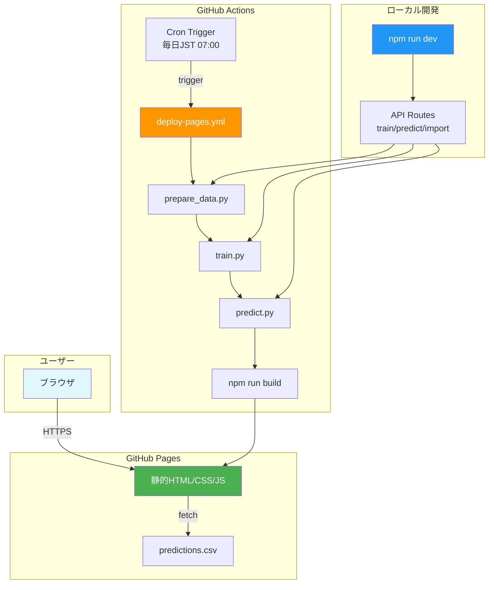
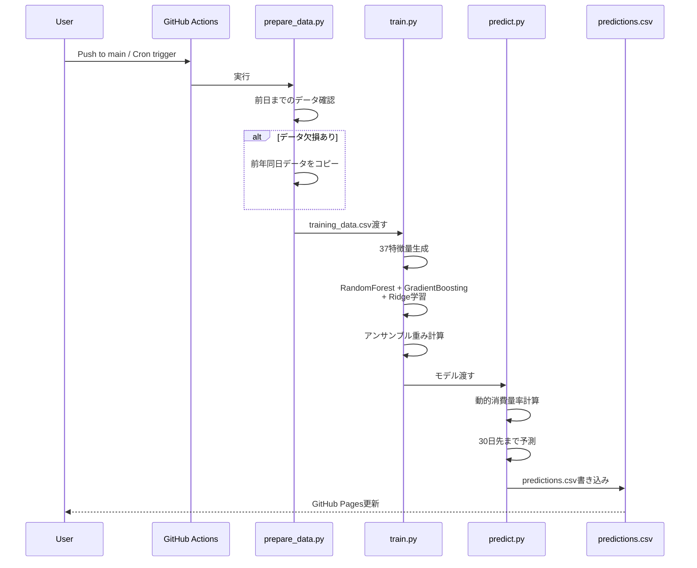

# ammonia_inventory_forecast - 完全実装仕様書（GitHub Pages版）

**📅 最終更新**: 2025年12月5日  
**ステータス**: ✅ Production Ready (GitHub Actions自動化)  
**公開URL**: https://j1921604.github.io/ammonia_inventory_forecast/  
**GitHubリポジトリ**: https://github.com/J1921604/ammonia_inventory_forecast  
**バージョン**: 1.0.0  
**リリース日**: 2025年12月5日

---

## 🎯 このドキュメントについて

この仕様書は、**アンモニア在庫レベル予測ダッシュボードの完全な実装仕様書**です。
GitHub ActionsによるCI/CD自動化、Next.js 14 を使用した静的サイト生成、predictions.csv データ管理を含みます。

---

## システム概要

### アーキテクチャ

アンモニア在庫レベル予測システムは、以下のコンポーネントで構成されています:

1. **フロントエンド層**: Next.js 14 + TypeScript による静的サイト生成
2. **データ管理層**: CSV形式での予測データ管理（predictions.csv）
3. **可視化層**: Chart.js による高度なグラフ表示
4. **AI予測層**: Python実装のAI予測エンジン（backend/ai_pipeline）

### システム構成図



### ワークフロー

```
毎日 JST 07:00 (GitHub Actions Cron)
↓
データ準備 (prepare_data.py)
(前日データがない場合 → 前年同日データから自動補完)
↓
AIパイプライン実行 (run_full_system.py)
(学習 → 予測 → predictions.csv更新)
↓
Next.js静的ビルド (npm run build)
↓
静的サイト生成 (out/ディレクトリ)
↓
GitHub Pages自動デプロイ
↓
デプロイ失敗時 → Issue自動作成
```

### AI統合ワークフロー（backend/ai_pipeline 実装）



```
データ準備フェーズ:
training_data.csv → 欠損確認 → 前年同日データ補完
  ↓
学習フェーズ:
training_data.csv → 特徴量生成（37項目） → アンサンブル学習
  ↓                                         (RandomForest + GradientBoosting + Ridge)
モデル保存 (ammonia_prediction_model.pkl)

予測フェーズ:
学習済みモデル読み込み → 動的消費量率計算 → 1ヶ月先予測
  ↓                     (発電量ベース物理モデル)
predictions.csv出力
```

### データ補完と GitHub Actions 連携

- `backend/ai_pipeline/data/training_data.csv` が学習データの正本、`backend/ai_pipeline/data/predictions.csv` が予測結果の正本です。
- `src/prepare_data.py` は前日までの `actual_power` / `actual_ammonia` が欠けている場合、前年同日の行をコピーしてギャップを自動補完します。
- `src/run_full_system.py` は `prepare_data → train → predict` を一括実行し、GitHub Actions と Next.js API から同じ手順で呼び出されます。
- CSV は `backend/ai_pipeline/data` 配下に集約したため、データ運用はこのフォルダのみを対象に行ってください。

#### training_data.csv インポート後に GitHub Actions を動かす手順

1. UI の「インポート」ボタン、または `POST /api/data/import` で CSV を送信すると、`training_data.csv` が上書き保存され、直後に `prepare_data.py` が実行されます。
2. `git add backend/ai_pipeline/data/training_data.csv && git commit && git push origin main` を実行し、変更をリモートへ反映します。
3. Push、または GitHub 上で **Actions → Deploy Ammonia Inventory Forecast → Run workflow** を実行すると、クラウド環境で再学習／再予測が行われ、最新CSVが `backend/ai_pipeline/data/predictions.csv` に反映されます。

> 🔒 GitHub Actions は外部APIから任意に発火できないため、ローカルインポート後は **必ずコミット＆プッシュ** するか、Actions 画面から手動実行してください。この制約を README と本仕様書に明記しています。

---

## データモデル

### CSVデータ形式 (predictions.csv)

```csv
date,actual_power,actual_ammonia,is_refill,predicted_ammonia,prediction_error,prediction_error_pct
2024-10-01 09:00:00,537297.1361,783.4997603,0,783.4997603,0.0,0.0
```

### カラム定義

| カラム名 | 型 | 説明 | 単位 | 範囲 |
|---------|-----|------|------|------|
| date | datetime | 日時 | YYYY-MM-DD HH:MM:SS | - |
| actual_power | float | 実績発電量 | kW | 0+ |
| actual_ammonia | float | 実績在庫レベル | m³ | 0-1200 |
| is_refill | int | 補充フラグ | - | 0 or 1 |
| predicted_ammonia | float | 予測在庫レベル | m³ | 0-1200 |
| prediction_error | float | 予測誤差 | m³ | - |
| prediction_error_pct | float | 予測誤差率 | % | - |

### データソース

| データ種別 | ソース | ファイル形式 | 更新頻度 |
|-----------|--------|------------|---------|
| 予測データ | ローカルCSV | `backend/ai_pipeline/data/predictions.csv` | 手動/自動 |
| 学習データ（AI） | ローカルCSV | `backend/ai_pipeline/data/training_data.csv` | 手動 |

### AI特徴量（将来統合予定）

backend/ai_pipeline のPython実装では、以下の37項目の特徴量を使用：

1. **動的物理特徴量（5項目）**: 動的消費量率、発電効率係数、理論消費量、消費効率
2. **時系列特徴量（8項目）**: 曜日、月、季節性、祝日フラグ、周期性
3. **ラグ特徴量（14項目）**: 1-7日ラグのアンモニア・発電量履歴
4. **統計特徴量（10項目）**: 移動平均、標準偏差、傾向分析

---

## フロントエンド仕様

### 技術スタック

| コンポーネント | バージョン | 用途 |
|--------------|----------|------|
| Next.js | 14.2.33 | 静的サイト生成フレームワーク |
| React | 18.2.0 | UIライブラリ |
| TypeScript | 5.x | 型安全なJavaScript |
| Chart.js | 4.4.1 | グラフ描画ライブラリ |
| react-chartjs-2 | 5.2.0 | Chart.jsのReactラッパー |

### ページ構成

```typescript
// app/page.tsx - メインダッシュボード
interface DataRow {
  date: string
  actual_power: string
  actual_ammonia: string
  is_refill: string
  predicted_ammonia: string
  prediction_error: string
  prediction_error_pct: string
}
```

### 主要機能

1. **チャート表示**
   - 実績在庫レベル（青緑ライン）
   - 予測在庫レベル（緑破線）
   - 補充レベル（ピンク破線）
   - 発電実績（オレンジライン、右軸）
   - 基準日の赤い縦線表示

2. **コントロールパネル**
   - 基準日選択（±7日、±1日ナビゲーション）
   - 月別ジャンプボタン（動的生成）
   - 補充レベル設定（±10ボタン、手動入力）
   - 学習・予測ボタン（将来統合予定）
   - CSV インポート/エクスポート

3. **警告システム**
   - 補充警告（在庫レベル < 閾値）
   - パルスアニメーション
   - データ範囲超過警告

4. **統計表示**
   - 基準日の在庫レベル
   - 予測精度（R²）
   - 平均予測誤差
   - 次回補充推奨日

---

## AI予測エンジン仕様（将来統合予定）

backend/ai_pipeline 内のPython実装：

### 1. RandomForest

**種別**: ランダムフォレスト

**ハイパーパラメータ**:
```python
{
    "n_estimators": 50,
    "max_depth": 8,
    "min_samples_split": 10,
    "min_samples_leaf": 5,
    "random_state": 42
}
```

### 2. GradientBoosting

**種別**: 勾配ブースティング

**ハイパーパラメータ**:
```python
{
    "n_estimators": 50,
    "max_depth": 4,
    "learning_rate": 0.1,
    "min_samples_split": 10,
    "min_samples_leaf": 5,
    "random_state": 42
}
```

### 3. Ridge回帰

**種別**: 正則化線形回帰

**ハイパーパラメータ**:
```python
{
    "alpha": 10.0
}
```

**期待精度**: 
- MAE（平均絶対誤差）: 0.98 m³
- R²（決定係数）: 0.9998

### アンサンブル重み付け

各モデルの予測値を重み付き平均：

```python
weight[model] = 1 / (MAE[model] + 1)
ensemble_prediction = Σ(weight[model] * prediction[model]) / Σ(weight[model])
```

---

## 精度指標

### MAE (Mean Absolute Error)

$$
\text{MAE} = \frac{1}{n} \sum_{i=1}^{n} |y_i - \hat{y}_i|
$$

**単位**: m³  
**目標値**: < 2.0 m³

### R² (決定係数)

$$
R^2 = 1 - \frac{\sum_{i=1}^{n} (y_i - \hat{y}_i)^2}{\sum_{i=1}^{n} (y_i - \bar{y})^2}
$$

**範囲**: 0 ~ 1  
**目標値**: > 0.95

---

## GitHub Actions ワークフロー

### トリガー

1. **Cron**: 毎日 UTC 22:00 (JST 07:00)
2. **Push**: mainブランチへのプッシュ
3. **手動**: workflow_dispatch

### ジョブフロー

```yaml
jobs:
  build-and-deploy:
    steps:
      - Checkout (fetch-depth: 0)
      - Setup Node.js 20.x
      - Install dependencies (npm ci)
      - Process predictions.csv data
        ↓ 前日データチェック
        ↓ 欠損があれば前年同日データから補完
      - Build Next.js (npm run build)
      - Export static site (out/)
      - Upload artifact (out/)
      - Deploy to GitHub Pages
      - Create Issue on failure
```

### 環境変数

```yaml
permissions:
  contents: write
  pages: write
  id-token: write
  issues: write
```

### 成果物

- `out/`: 静的サイト生成出力
- `backend/ai_pipeline/data/predictions.csv`: 予測データ（自動補完済み）

### データ自動補完ロジック

```javascript
// 前日データがない場合、前年同日のデータをコピー
const yesterday = new Date(today)
yesterday.setDate(yesterday.getDate() - 1)

if (!hasDataForDate(yesterday)) {
  const lastYearDate = new Date(yesterday)
  lastYearDate.setFullYear(lastYearDate.getFullYear() - 1)
  
  copyDataFromDate(lastYearDate, yesterday)
}
```

---

## 動的消費量率の計算（backend/ai_pipeline 実装）

### 物理ベース計算式

```python
# 消費量率の算出
consumption_rate = daily_consumption / (power_kw / 1000)  # m³/MWh

# 動的消費量率（発電効率考慮）
power_factor = 1.0 + (power_mwh - 400) / 1000  # 400MWh基準
dynamic_consumption_rate = consumption_rate * power_factor
```

### 実装例 (backend/ai_pipeline/src/train.py)

```python
def calculate_consumption_rate(self, df):
    """発電量に基づく消費率計算（物理ベース）"""
    valid_rates = []
    
    for i in range(1, len(df)):
        if df.iloc[i]['is_refill'] == 0:
            consumption = df.iloc[i-1]['actual_ammonia'] - df.iloc[i]['actual_ammonia']
            power_mwh = df.iloc[i]['actual_power'] / 1000
            
            if consumption > 0 and power_mwh > 0:
                rate = consumption / power_mwh  # m³/MWh
                if 0 < rate < 0.5:
                    valid_rates.append(rate)
    
    return np.median(valid_rates)  # 中央値を採用
```

### 計算結果例

- **消費量率**: 0.020884 m³/MWh（実データ分析による算出値）
- **標準偏差**: 0.005 m³/MWh
- **効率係数範囲**: 0.6 ~ 1.4（発電量レベルに応じて動的調整）

---

## デプロイ仕様

### GitHub Pages設定

| 項目   | 値             |
| ------ | -------------- |
| Source | GitHub Actions |
| Branch | (自動管理)     |
| URL    | https://j1921604.github.io/ammonia_inventory_forecast/ |

### ディレクトリ構成

```
_site/  (GitHub Pages デプロイディレクトリ)
├── index.html
└── AI/
    ├── metrics.json
    ├── tomorrow/
    │   ├── LightGBM/
    │   │   └── LightGBM_tomorrow.png
    │   ├── Keras/
    │   ├── RandomForest/
    │   └── Pycaret/
    └── train/
        ├── LightGBM/
        │   └── LightGBM_Ypred.png
        ├── Keras/
        ├── RandomForest/
        └── Pycaret/
```

### index.html

静的HTML + JavaScript で実装:

- `fetch('AI/metrics.json')` で精度指標取得
- `` で画像表示
- レスポンシブ対応（モバイル/タブレット/デスクトップ）

---

## Issue自動通知

### トリガー条件

```bash
if [ -z "$R2" ] || [ $(echo "$R2 < 0.8" | bc -l) -eq 1 ]; then
  # Issue作成
fi
```

### Issue内容

**タイトル**: `⚠️ 予測精度低下検出 (YYYY-MM-DD)`

**本文**:
```markdown
## 予測精度が低下しています

**検出日時**: 2025-11-24T15:00:00Z

### 精度指標
- **RMSE**: 650.5 kW
- **R²**: 0.75
- **MAE**: 520.3 kW

### 推奨アクション
1. 学習データの確認
2. ハイパーパラメータの再調整
3. データの異常値チェック

詳細は [GitHub Actions ログ](...) を確認してください。
```

**ラベル**: `accuracy-alert`, `automated`

---

## プロジェクト構造

```
ammonia_inventory_forecast/
├── .github/
│   ├── agents/
│   │   ├── copilot-instructions.md
│   │   └── (その他エージェント設定)
│   └── workflows/
│       └── deploy.yml              # GitHub Pages自動デプロイ
├── backend/
│   └── ai_pipeline/                # AI予測システム（Python実装）
│       ├── src/
│       │   ├── train.py            # AI学習エンジン（37特徴量）
│       │   ├── predict.py          # AI予測エンジン（動的消費量率）
│       │   ├── preprocess.py       # データ前処理
│       │   ├── prepare_data.py     # データ補完スクリプト
│       │   ├── features.py         # 特徴量エンジニアリング
│       │   ├── server.py           # API統合用サーバー
│       │   └── run_full_system.py  # ワンクリック実行
│       ├── data/
│       │   ├── training_data.csv   # 学習データ
│       │   └── predictions.csv     # AI予測結果
│       ├── requirements.txt        # Python依存関係
│       └── README.md               # AI詳細仕様
├── app/
│   ├── api/                        # APIルート
│   │   ├── ml/                     # 機械学習API (train, predict)
│   │   └── data/                   # データ管理API (import, export)
│   ├── layout.tsx                  # ルートレイアウト
│   ├── page.tsx                    # メインダッシュボード
│   └── globals.css                 # グローバルスタイル
├── public/
│   └── data/
│       └── predictions.csv         # 予測データ
├── docs/
│   ├── 完全仕様書.md               # 本ファイル
│   └── DEPLOY_GUIDE.md             # デプロイガイド
├── out/                            # ビルド出力（GitHub Pages用）
├── .gitignore                      # Git除外設定
├── next.config.js                  # Next.js設定
├── package.json                    # Node.js依存関係
├── package-lock.json               # 依存関係ロックファイル
├── tsconfig.json                   # TypeScript設定
└── README.md                       # プロジェクト概要
```

---

## デプロイ仕様

### GitHub Pages設定

| 項目   | 値             |
| ------ | -------------- |
| Source | GitHub Actions |
| Branch | (自動管理)     |
| URL    | https://j1921604.github.io/ammonia_inventory_forecast/ |

### ビルド出力構造

```
out/  (GitHub Pages デプロイディレクトリ)
├── index.html
├── _next/
│   ├── static/
│   │   └── chunks/
│   └── ...
└── data/
    └── predictions.csv
```

### Next.js静的サイト生成

```bash
npm run build  # Next.jsビルド
# → out/ ディレクトリに静的ファイル生成
```

---

## Issue自動通知

### トリガー条件

```yaml
- name: Create Issue on Failure
  if: failure()
  uses: actions/github-script@v7
```

### Issue内容

**タイトル**: `⚠️ デプロイ失敗 (YYYY-MM-DD)`

**本文**:
```markdown
## GitHub Pages デプロイが失敗しました

**検出日時**: 2025-12-05T22:00:00Z

### エラー詳細
ワークフロー実行ログを確認してください。

### 推奨アクション
1. predictions.csvの形式確認
2. ビルドログの確認
3. 依存関係の確認

詳細は [GitHub Actions ログ](...) を確認してください。
```

**ラベル**: `deployment-failure`, `automated`

---

## トラブルシューティング

### 問題1: GitHub Actions失敗

**症状**: ワークフローが途中で失敗

**確認**:
```bash
# ローカルで再現
npm install
npm run build
```

**解決**:
- predictions.csv形式エラー → CSVフォーマット確認
- 依存関係不足 → `package.json` 確認
- Node.jsバージョン → 20.x以上を使用

### 問題2: GitHub Pages 404

**症状**: デプロイ成功だがページが表示されない

**確認**:
- Settings → Pages → Source: **GitHub Actions**
- `out/` ディレクトリに `index.html` が存在するか
- `next.config.js` の `basePath` 設定確認

**解決**:
```bash
# ワークフローを手動再実行
https://github.com/J1921604/ammonia_inventory_forecast/actions
→ "Run workflow"
```

### 問題3: CSVインポートが失敗

**症状**: CSVファイルをインポートできない

**確認**:
- CSVフォーマットが正しいか
- ヘッダー行が存在するか
- 文字エンコーディングがUTF-8か

**解決**:
```csv
# 正しいフォーマット例
date,actual_power,actual_ammonia,is_refill,predicted_ammonia,prediction_error,prediction_error_pct
2024-10-01 09:00:00,537297.1361,783.4997603,0,783.4997603,0.0,0.0
```

### 問題4: AI学習・予測ボタンが動作しない

**症状**: ボタンをクリックしても何も起こらない、または警告が表示される

**説明**: 
- 学習・予測・インポート機能は**ローカル環境（localhost）でのみ**利用可能です
- GitHub Pages (https://j1921604.github.io/ammonia_inventory_forecast/) 上ではセキュリティとランタイムの制約により、これらの機能は無効化されています
- ローカル環境で実行するには `npm run dev` を使用してください

**AI予測の実行方法（手動）**:
```bash
cd backend/ai_pipeline
pip install -r requirements.txt
python src/prepare_data.py # データ補完
python src/train.py        # モデル学習
python src/predict.py      # 予測実行
```

---

## 参考リンク

- **Live Demo**: https://j1921604.github.io/ammonia_inventory_forecast/
- **GitHubリポジトリ**: https://github.com/J1921604/ammonia_inventory_forecast
- **GitHub Actions**: https://github.com/J1921604/ammonia_inventory_forecast/actions
- **デプロイガイド**: [docs/DEPLOY_GUIDE.md](https://github.com/J1921604/ammonia_inventory_forecast/blob/main/docs/DEPLOY_GUIDE.md)
- **AI詳細仕様**: [README.md の AI セクション](https://github.com/J1921604/ammonia_inventory_forecast/blob/main/README.md#ai%E4%BA%88%E6%B8%AC%E3%82%A8%E3%83%B3%E3%82%B8%E3%83%B3python)
