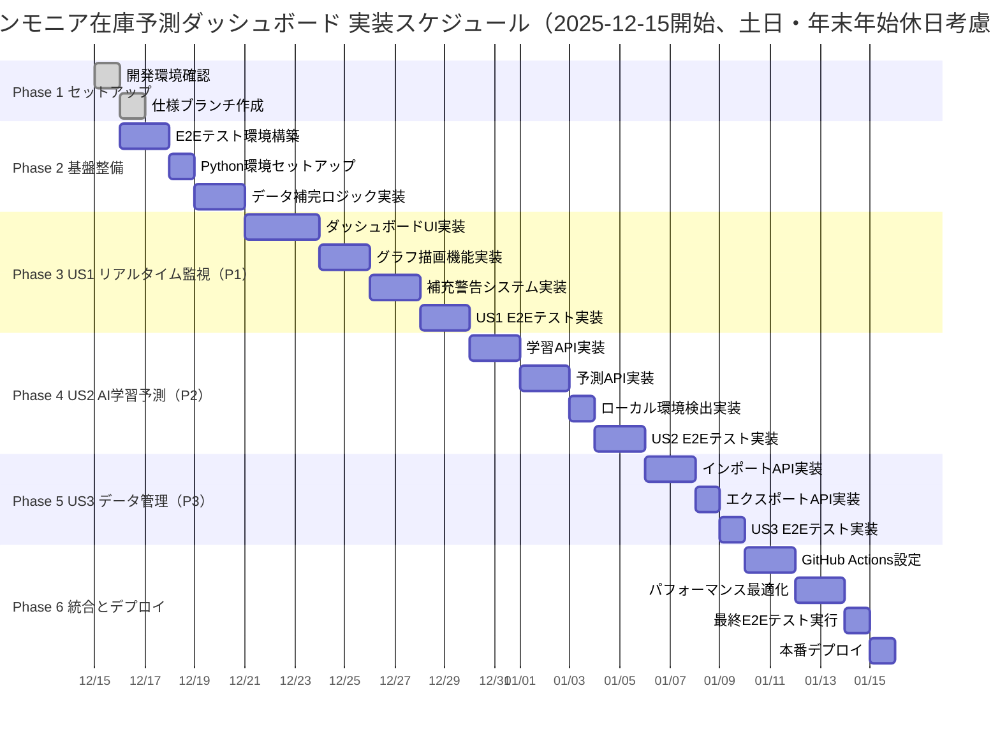

# 実装計画: アンモニア在庫レベル予測ダッシュボード

**Branch**: `feature/impl-001-ammonia_inventory_forecast` | **Date**: 2025-12-05 | **Spec**: [spec.md](./spec.md)  
**Input**: 機能仕様書 `/specs/001-ammonia_inventory_forecast/spec.md`

## 概要

Next.js 14とPython AIパイプラインを統合したアンモニア在庫予測ダッシュボードの実装。GitHub Pages静的サイトとして公開し、毎日JST 07:00に自動でデータ更新・予測・デプロイを実行する。ローカル環境ではAIモデル学習・予測・CSVインポート/エクスポート機能を提供する。

## 技術コンテキスト

**Language/Version**: TypeScript 5.x (フロントエンド), Python 3.10.11 (AI)  
**Primary Dependencies**: Next.js 14, React 18, Chart.js 4.4.1, scikit-learn, pandas  
**Storage**: CSV形式（backend/ai_pipeline/data/）  
**Testing**: Playwright (E2E), pytest (Python)  
**Target Platform**: GitHub Pages (静的サイト), ローカル環境（AI実行）  
**Project Type**: Web (フロントエンド + AIバックエンド)  
**Performance Goals**: ページロード3秒、グラフ描画1秒、AI学習30秒、AI予測10秒  
**Constraints**: GitHub Pages静的サイト制約、Python実行はローカルとGitHub Actionsのみ  
**Scale/Scope**: 1000データポイント、30日予測、37特徴量、3モデルアンサンブル

## 憲法チェック

*GATE: Phase 0研究前に合格必須。Phase 1設計後に再チェック。*

✅ **テスト駆動開発の徹底**:
- E2Eテスト（Playwright）でユーザーストーリーを100%カバー
- Pythonユニットテスト（pytest）でAI予測ロジックを検証
- テストファースト: 実装前にテストコード作成

✅ **セキュリティ要件の最優先**:
- HTTPS通信（GitHub Pages自動提供）
- 環境変数は`.env`で管理、`.gitignore`で除外
- ローカル環境以外でAI機能を無効化

✅ **パフォーマンス閾値の定量化**:
- ページロード: 3秒以内（95パーセンタイル）
- グラフ描画: 1秒以内
- AI学習: 30秒以内
- AI予測: 10秒以内
- GitHub Actions: 5分以内

✅ **データ整合性の確保**:
- 単一正本: `backend/ai_pipeline/data/` 配下のCSVファイル
- 前年同日自動補完ロジック（prepare_data.py）
- Git履歴で全変更を追跡

✅ **完全自動化と再現性**:
- GitHub Actions毎日JST 07:00自動実行
- package.json/requirements.txtでバージョン固定
- ローカルとCI環境で同一ビルド手順

## プロジェクト構造

### ドキュメント（この機能）

```text
specs/001-ammonia_inventory_forecast/
├── spec.md                  # 機能仕様書（完成）
├── requirements.md          # 要件チェックリスト（完成）
├── plan.md                  # このファイル（実装計画）
└── tasks.md                 # タスク詳細（次のステップで作成）
```

### ソースコード（リポジトリルート）

```text
ammonia_inventory_forecast/
├── .github/
│   └── workflows/
│       └── deploy-pages.yml         # GitHub Pages自動デプロイ
├── app/
│   ├── api/
│   │   ├── ml/
│   │   │   ├── train/route.ts       # AI学習API（localhost専用）
│   │   │   └── predict/route.ts     # AI予測API（localhost専用）
│   │   └── data/
│   │       ├── import/route.ts      # CSVインポートAPI（localhost専用）
│   │       ├── export/route.ts      # CSVエクスポートAPI（localhost専用）
│   │       └── predictions/route.ts # predictions.csv取得API
│   ├── layout.tsx                   # ルートレイアウト
│   ├── page.tsx                     # メインダッシュボード
│   └── globals.css                  # グローバルスタイル
├── backend/
│   └── ai_pipeline/
│       ├── src/
│       │   ├── prepare_data.py      # データ補完
│       │   ├── train.py             # AI学習
│       │   ├── predict.py           # AI予測
│       │   ├── preprocess.py        # データ前処理
│       │   ├── features.py          # 特徴量生成
│       │   └── run_full_system.py   # 一括実行
│       ├── data/
│       │   ├── training_data.csv    # 学習データ正本
│       │   └── predictions.csv      # 予測データ正本
│       ├── models/                  # 学習済みモデル
│       └── requirements.txt         # Python依存関係
├── lib/
│   └── pythonRunner.ts              # Python実行ヘルパー
├── public/
│   └── data/
│       └── predictions.csv          # 静的サイト用コピー
├── tests/
│   └── e2e/
│       ├── dashboard.spec.ts        # ダッシュボードE2Eテスト
│       ├── chart-rendering.spec.ts  # グラフ描画テスト
│       └── performance.spec.ts      # パフォーマンステスト
├── next.config.js                   # Next.js設定
├── package.json                     # Node.js依存関係
└── tsconfig.json                    # TypeScript設定
```

**構造決定**: Webアプリケーション構造を選択（フロントエンド + AIバックエンド分離）。既存のディレクトリ構造を維持し、仕様ドキュメントをspecs/001-ammonia_inventory_forecast/に配置。

## 実装スケジュール



## データモデル設計

### CSVデータスキーマ

**predictions.csv** (予測データ正本):
```csv
date,actual_power,actual_ammonia,is_refill,predicted_ammonia,prediction_error,prediction_error_pct
2024-10-01 09:00:00,537297.1361,783.4997603,0,783.4997603,0.0,0.0
```

| カラム名 | 型 | 必須 | 説明 | 範囲/制約 |
|---------|-----|------|------|----------|
| date | datetime | ✅ | 日時（YYYY-MM-DD HH:MM:SS） | - |
| actual_power | float | ✅ | 実績発電量（kW） | 0+ |
| actual_ammonia | float | ✅ | 実績在庫レベル（m³） | 0-1200 |
| is_refill | int | ✅ | 補充フラグ | 0 or 1 |
| predicted_ammonia | float | ✅ | 予測在庫レベル（m³） | 0-1200 |
| prediction_error | float | ✅ | 予測誤差（m³） | - |
| prediction_error_pct | float | ✅ | 予測誤差率（%） | - |

**training_data.csv** (学習データ正本):
```csv
date,actual_power,actual_ammonia,is_refill
2024-10-01 09:00:00,537297.1361,783.4997603,0
```

| カラム名 | 型 | 必須 | 説明 | 範囲/制約 |
|---------|-----|------|------|----------|
| date | datetime | ✅ | 日時 | - |
| actual_power | float | ✅ | 実績発電量（kW） | 0+ |
| actual_ammonia | float | ✅ | 実績在庫レベル（m³） | 0-1200 |
| is_refill | int | ✅ | 補充フラグ | 0 or 1 |

### TypeScriptインターフェース

```typescript
// app/types/index.ts
export interface DataRow {
  date: string
  actual_power: string
  actual_ammonia: string
  is_refill: string
  predicted_ammonia: string
  prediction_error: string
  prediction_error_pct: string
}

export interface ChartData {
  labels: string[]
  datasets: {
    label: string
    data: number[]
    borderColor: string
    backgroundColor?: string
    borderDash?: number[]
    yAxisID?: string
  }[]
}

export interface StatisticsData {
  baselineLevel: number
  r2Score: number
  avgError: number
  nextRefillDate: string | null
}
```

## APIエンドポイント設計

### GET /api/data/predictions

**説明**: predictions.csvを取得（全環境で利用可能）

**レスポンス**:
```json
{
  "success": true,
  "data": [
    {
      "date": "2024-10-01 09:00:00",
      "actual_power": "537297.1361",
      "actual_ammonia": "783.4997603",
      "is_refill": "0",
      "predicted_ammonia": "783.4997603",
      "prediction_error": "0.0",
      "prediction_error_pct": "0.0"
    }
  ]
}
```

### POST /api/ml/train（localhost専用）

**説明**: AIモデルを学習

**リクエスト**: なし

**レスポンス**:
```json
{
  "success": true,
  "message": "モデル学習完了",
  "metrics": {
    "r2": 0.9998,
    "mae": 0.98
  }
}
```

### POST /api/ml/predict（localhost専用）

**説明**: 30日先まで予測

**リクエスト**: なし

**レスポンス**:
```json
{
  "success": true,
  "message": "予測完了",
  "days": 30
}
```

### POST /api/data/import（localhost専用）

**説明**: training_data.csvをインポート

**リクエスト**: FormData（file: training_data.csv）

**レスポンス**:
```json
{
  "success": true,
  "message": "インポート完了。データ補完を実行しました。"
}
```

### GET /api/data/export（localhost専用）

**説明**: training_data.csvをダウンロード

**レスポンス**: CSV file download

## 複雑性追跡

本プロジェクトは憲法チェックに違反していません。

## 次のステップ

1. `tasks.md`作成: `/speckit.tasks`コマンドでタスク詳細を生成
2. 実装開始: Phase 1セットアップから順次実装
3. E2Eテスト: 各フェーズ完了後に検証
4. デプロイ: GitHub Actions設定と本番リリース

**Version**: 1.0.0 | **Created**: 2025-12-05 | **Last Updated**: 2025-12-05
