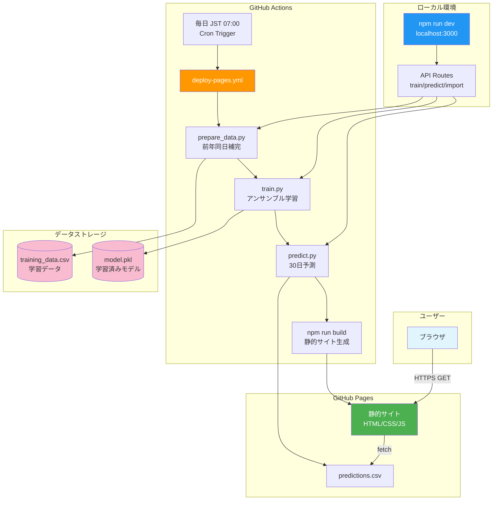
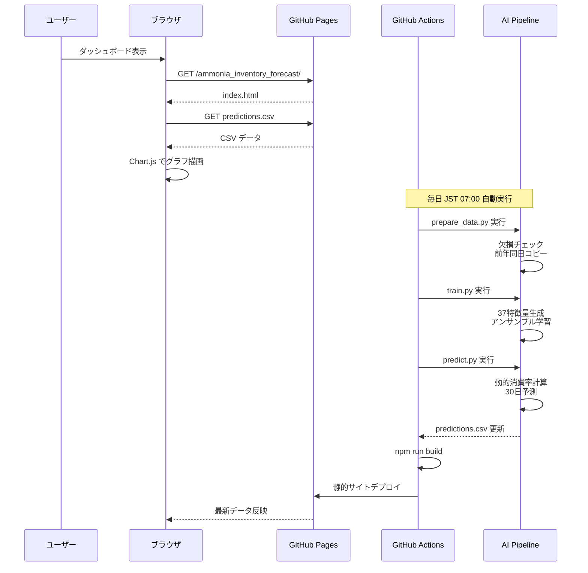

# 機能仕様書: アンモニア在庫レベル予測ダッシュボード

**Feature Branch**: `001-ammonia_inventory_forecast`  
**Created**: 2025-12-05  
**Status**: Draft  
**Version**: 1.0.0

## ユーザーシナリオとテスト（必須）

### ユーザーストーリー1 - リアルタイム在庫監視（優先度: P1）

運用担当者が毎日、アンモニア在庫レベルをダッシュボードで確認し、補充タイミングを判断する。

**この優先度の理由**: 在庫切れは発電停止に直結するため、最も重要な機能。

**独立テスト**: ブラウザでダッシュボードにアクセスし、過去30日と未来30日の在庫グラフが表示されることを確認。補充レベル（デフォルト600m³）を下回る予測日が警告表示されることを検証。

**受入シナリオ**:

1. **Given** ダッシュボードを開いた状態で、**When** 基準日を選択する、**Then** 基準日を中心に前後30日のデータがグラフ表示される
2. **Given** 予測在庫が補充レベルを下回る日がある、**When** グラフを表示する、**Then** 警告アイコンとパルスアニメーションが表示され、次回補充推奨日が統計情報に表示される
3. **Given** 基準日をナビゲーションボタン（±1日、±7日）で変更する、**When** ボタンをクリックする、**Then** グラフが即座に更新される

---

### ユーザーストーリー2 - AI予測モデルの学習と更新（優先度: P2）

データアナリストがローカル環境で新しい履歴データを取り込み、AIモデルを再学習して予測精度を向上させる。

**この優先度の理由**: 予測精度の維持に必要だが、日次運用には直接影響しない。

**独立テスト**: ローカル環境（localhost）で「学習」ボタンをクリックし、backend/ai_pipeline/src/train.pyが実行され、モデルファイルが更新されることを確認。GitHub Pages上ではボタンが無効化され、警告メッセージが表示されることを検証。

**受入シナリオ**:

1. **Given** training_data.csvに新しいデータを追加した状態で、**When** 「学習」ボタンをクリックする（localhost）、**Then** Pythonパイプラインが実行され、モデルが更新され、完了メッセージが表示される
2. **Given** GitHub Pagesでダッシュボードを開いた状態で、**When** 「学習」ボタンにマウスオーバーする、**Then** ボタンが無効状態で、「ローカル環境でのみ利用可能」という警告が表示される
3. **Given** ローカル環境でモデル学習完了後、**When** 「予測」ボタンをクリックする、**Then** 最新モデルで30日先まで予測し、predictions.csvが更新される

---

### ユーザーストーリー3 - データのインポート/エクスポート（優先度: P3）

運用担当者がExcelで管理している履歴データをCSV形式でインポートし、予測結果をエクスポートして報告資料に使用する。

**この優先度の理由**: データ管理の利便性向上だが、コア機能ではない。

**独立テスト**: localhost環境で「インポート」ボタンからtraining_data.csvをアップロードし、自動的にprepare_data.pyが実行されて欠損データが補完されることを確認。「エクスポート」ボタンで現在のtraining_data.csvがダウンロードできることを検証。

**受入シナリオ**:

1. **Given** 新しいtraining_data.csvファイルを準備した状態で、**When** 「インポート」ボタンからファイルを選択してアップロードする、**Then** ファイルがbackend/ai_pipeline/data/に保存され、前年同日データで欠損を補完するprepare_data.pyが自動実行され、完了メッセージが表示される
2. **Given** データ管理パネルを開いた状態で、**When** 「エクスポート」ボタンをクリックする、**Then** 現在のtraining_data.csvがダウンロードされる
3. **Given** GitHub Pages環境でダッシュボードを表示した状態で、**When** インポート/エクスポートボタンを確認する、**Then** 両ボタンが無効化され、「ローカル環境専用」警告が表示される

---

### エッジケース

- **データ範囲外の日付を選択した場合**: 基準日が利用可能データ範囲を超えた場合、警告メッセージを表示し、最も近い有効な日付に自動調整する
- **CSV形式エラー**: インポートしたCSVのヘッダーが不正な場合、エラーメッセージで必要なカラム（date, actual_power, actual_ammonia等）を明示する
- **AIモデル未学習**: モデルファイルが存在しない状態で予測を実行した場合、「先にモデルを学習してください」というメッセージを表示する
- **ネットワーク遮断時**: GitHub Actionsのcron実行が失敗した場合、Issue自動作成でアラートを送信する
- **同時編集**: 複数ユーザーが同時にローカル環境でCSVを編集した場合、Gitコンフリクトが発生する可能性があるため、コミット前にgit pullを促すメッセージを表示する

## 要件（必須）

### 機能要件

- **FR-001**: システムは過去30日と未来30日の在庫レベルをインタラクティブなグラフで表示しなければならない
- **FR-002**: システムは基準日を中心にデータ範囲をナビゲーションする機能（±1日、±7日、月別ジャンプ）を提供しなければならない
- **FR-003**: システムは予測在庫が設定した補充レベル（デフォルト600m³）を下回る日を自動検出し、警告を表示しなければならない
- **FR-004**: システムは予測精度（R²スコア）、平均予測誤差、次回補充推奨日を統計情報として表示しなければならない
- **FR-005**: システムはlocalhost環境でのみ、AIモデルの学習・予測・CSVインポート/エクスポート機能を提供しなければならない
- **FR-006**: システムはGitHub Pages環境では学習・予測・インポート/エクスポートボタンを自動的に無効化し、理由を明示した警告を表示しなければならない
- **FR-007**: システムは毎日JST 07:00にGitHub Actionsで自動的にデータ補完・学習・予測・デプロイを実行しなければならない
- **FR-008**: システムはtraining_data.csvの欠損日を前年同日データから自動補完しなければならない（prepare_data.py）
- **FR-009**: システムはRandomForest、GradientBoosting、Ridge回帰のアンサンブルモデルで予測精度を最大化しなければならない
- **FR-010**: システムは発電量に基づく動的消費量率（物理ベース）で理論消費量を計算しなければならない

### 主要エンティティ

- **予測データ（PredictionData）**: 日時、実績発電量、実績在庫レベル、補充フラグ、予測在庫レベル、予測誤差、予測誤差率
  - データソース: `backend/ai_pipeline/data/predictions.csv`
  - 更新頻度: 毎日JST 07:00（GitHub Actions自動実行）
  
- **学習データ（TrainingData）**: 日時、実績発電量、実績在庫レベル、補充フラグ
  - データソース: `backend/ai_pipeline/data/training_data.csv`
  - 更新方法: 手動インポート（localhost）またはGit経由
  
- **AIモデル（AmmoniaModel）**: 学習済みモデル、消費率統計、特徴量重要度
  - ストレージ: `backend/ai_pipeline/models/ammonia_prediction_model.pkl`
  - 学習頻度: 手動（localhost）またはGitHub Actions（毎日）

## 成功基準（必須）

### 測定可能な成果

- **SC-001**: ユーザーはダッシュボードを3秒以内にロードできる（95パーセンタイル）
- **SC-002**: システムは1000件のデータポイントを含むグラフを1秒以内にレンダリングする
- **SC-003**: AI予測精度（R²スコア）は0.95以上を維持する
- **SC-004**: 平均予測誤差（MAE）は2.0 m³以下である
- **SC-005**: GitHub Actions自動デプロイは5分以内に完了する
- **SC-006**: ローカル環境でのAI学習は30秒以内に完了する
- **SC-007**: ローカル環境でのAI予測（30日先）は10秒以内に完了する
- **SC-008**: モバイル、タブレット、デスクトップの全デバイスで一貫したUI/UXを提供する
- **SC-009**: システムはデータ欠損がある場合でも、前年同日データで100%自動補完する
- **SC-010**: 補充警告の誤検知率（false positive）は5%以下である

## システムアーキテクチャ



## データフロー



## 技術仕様

### フロントエンド

- **フレームワーク**: Next.js 14 (App Router)
- **言語**: TypeScript 5.x
- **UIライブラリ**: React 18
- **グラフ描画**: Chart.js 4.4.1 + react-chartjs-2 5.2.0
- **スタイル**: CSS Modules + グローバルCSS（ダークモード対応）

### バックエンド（AI予測）

- **言語**: Python 3.10.11
- **実行コマンド**: `py -3.10`
- **機械学習**: scikit-learn（RandomForest、GradientBoosting、Ridge）
- **データ処理**: pandas、numpy
- **特徴量**: 37項目（時系列、ラグ、統計、物理ベース動的消費率）

### デプロイ環境

- **本番**: GitHub Pages（https://j1921604.github.io/ammonia_inventory_forecast/）
- **自動化**: GitHub Actions（.github/workflows/deploy-pages.yml）
- **更新頻度**: 毎日 JST 07:00（cron: '0 22 * * *'）

### データ形式

```csv
date,actual_power,actual_ammonia,is_refill,predicted_ammonia,prediction_error,prediction_error_pct
2024-10-01 09:00:00,537297.1361,783.4997603,0,783.4997603,0.0,0.0
```

## パフォーマンス要件

- **ページロード時間**: 3秒以内（95パーセンタイル）
- **グラフレンダリング**: 1秒以内（1000データポイント）
- **AI学習時間**: 30秒以内（localhost）
- **AI予測時間**: 10秒以内（30日先、localhost）
- **GitHub Actions実行時間**: 5分以内（データ補完→学習→予測→ビルド→デプロイ）

## セキュリティ要件

- **HTTPS通信**: GitHub Pages自動提供
- **環境変数**: ローカル環境のみ`.env`使用、リポジトリには含めない
- **APIアクセス制限**: localhost環境以外では学習・予測・インポート機能を無効化
- **データ検証**: CSVインポート時にヘッダーとデータ形式を検証

## 制約事項

- **GitHub Pages制約**: サーバーサイド実行不可、静的サイトのみ
- **Python実行環境**: ローカル環境とGitHub Actionsのみ
- **データ更新フロー**: ローカルインポート → Git コミット/プッシュ → GitHub Actions自動実行
- **GitHub Actions制約**: ローカルAPIから直接トリガー不可

**Version**: 1.0.0 | **Created**: 2025-12-05
