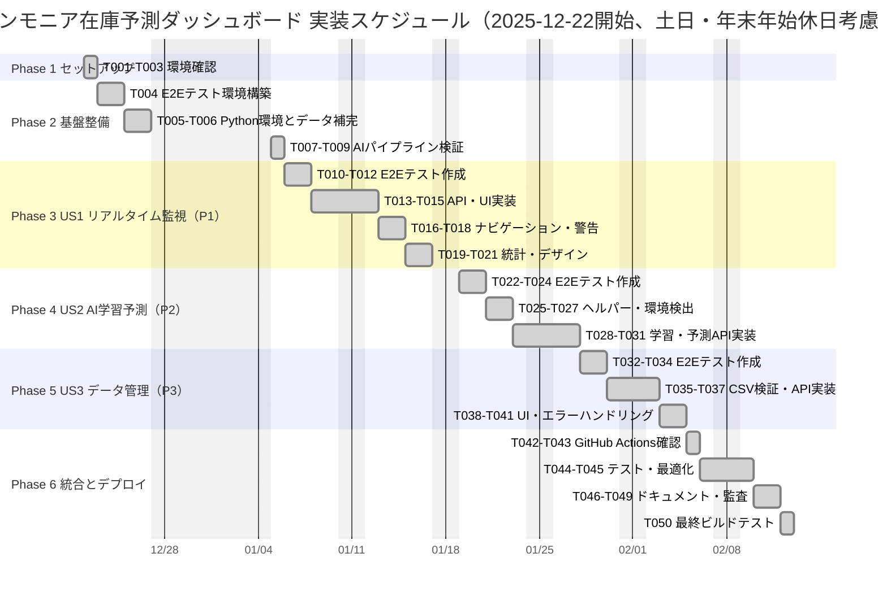

# タスク: アンモニア在庫レベル予測ダッシュボード

**Input**: 設計ドキュメント `/specs/001-ammonia_inventory_forecast/`
**Prerequisites**: plan.md（必須）、spec.md（ユーザーストーリー用）、requirements.md

**Tests**: E2Eテストと単体テストを各ユーザーストーリーに含む

**Organization**: タスクはユーザーストーリーごとにグループ化し、各ストーリーの独立実装とテストを可能にする

## 実装スケジュール（相対日付方式）

**開始日**: 2025-12-22（月） - 任意に変更可能
**土日・年末年始休日**: 自動考慮（土日はスキップ、年末年始は2025-12-28〜2026-01-05を除外）
**調整方法**: 開始日を変更する場合、最初のタスク日付を修正すれば全体が自動調整されます



**スケジュール調整ガイド**:

- 開始日変更: 最初のタスク（p1）の日付を変更（例: 2025-12-22 → 2026-01-05）
- 期間調整: 各タスクの日数（例: `2d`）を変更
- 休日対応: `excludes weekends` で土日を自動スキップ、年末年始（2025-12-27〜2026-01-04）も除外
- 年末年始調整: 開始日を変更する場合、`excludes`の年末年始日付も適宜更新

## フォーマット: `[ID] [P?] [Story] Description`

- **[P]**: 並列実行可能（異なるファイル、依存関係なし）
- **[Story]**: 所属するユーザーストーリー（US1, US2, US3）
- ファイルパスを含む正確な説明

## パス規則

本プロジェクトはWebアプリケーション構造:

- フロントエンド: `app/`、`lib/`、`public/`
- バックエンド: `backend/ai_pipeline/src/`
- テスト: `tests/e2e/`

---

## Phase 1: セットアップ（共通インフラ）

**目的**: プロジェクト初期化と基本構造

- [X] T001 プロジェクト構造確認（app/, backend/, tests/）
- [X] T002 [P] Next.js 14とTypeScript依存関係確認（package.json）
- [X] T003 [P] Python 3.10.11環境確認とrequirements.txt検証

---

## Phase 2: 基盤整備（全ストーリーのブロック要因）

**目的**: 全ユーザーストーリー実装前に完了必須のコア基盤

**⚠️ CRITICAL**: この段階完了まで、ユーザーストーリー作業は開始不可

- [X] T004 E2Eテスト環境セットアップ（Playwright設定in playwright.config.ts）
- [X] T005 [P] Python環境セットアップ（backend/ai_pipeline/requirements.txt）
- [X] T006 [P] データ補完ロジック実装（backend/ai_pipeline/src/prepare_data.py）
- [X] T007 [P] 既存AIパイプライン検証（train.py, predict.py）
- [X] T008 データ正本の配置確認（backend/ai_pipeline/data/）
- [X] T009 Next.js設定確認（next.config.js: output: 'export', basePath）

**Checkpoint**: 基盤準備完了 - ユーザーストーリー実装を並列開始可能

---

## Phase 3: ユーザーストーリー1 - リアルタイム在庫監視（優先度: P1）🎯 MVP

**Goal**: 運用担当者が毎日、ダッシュボードで在庫レベルを確認し、補充タイミングを判断できる

**Independent Test**: ブラウザでダッシュボードにアクセスし、グラフと警告が正常に表示されることを確認

### Tests for User Story 1⚠️

> **NOTE: これらのテストを最初に作成し、失敗することを確認してから実装**

- [X] T010 [P] [US1] E2Eテスト: ダッシュボード表示（tests/e2e/dashboard.spec.ts）
- [X] T011 [P] [US1] E2Eテスト: グラフ描画（tests/e2e/chart-rendering.spec.ts）
- [X] T012 [P] [US1] E2Eテスト: パフォーマンス（tests/e2e/performance.spec.ts）

### Implementation for User Story 1

- [X] T013 [P] [US1] predictions.csv取得API実装（app/api/data/predictions/route.ts）
- [X] T014 [US1] メインダッシュボードコンポーネント実装（app/page.tsx）
- [X] T015 [US1] Chart.js統合とグラフ描画ロジック（app/page.tsx内）
- [X] T016 [US1] 基準日ナビゲーション実装（±1日、±7日、月別ジャンプ）
- [X] T017 [US1] 補充レベル設定UI実装（±10ボタン、手動入力）
- [X] T018 [US1] 補充警告システム実装（補充レベル判定とパルスアニメーション）
- [X] T019 [US1] 統計情報表示実装（R²、平均誤差、次回補充日）
- [X] T020 [US1] レスポンシブデザイン実装（globals.css）
- [X] T021 [US1] ダークモードUI実装（グローバルCSS）

**Checkpoint**: この段階で、US1が完全に機能し、独立してテスト可能

---

## Phase 4: ユーザーストーリー2 - AI学習予測（優先度: P2）

**Goal**: データアナリストがローカル環境でAIモデルを再学習し、予測精度を向上させる

**Independent Test**: localhost環境で学習・予測ボタンをクリックし、正常に実行されることを確認。GitHub Pages環境ではボタンが無効化されることを検証

### Tests for User Story 2⚠️

- [X] T022 [P] [US2] E2Eテスト: 学習API（localhost環境）
- [X] T023 [P] [US2] E2Eテスト: 予測API（localhost環境）
- [X] T024 [P] [US2] E2Eテスト: ボタン無効化（GitHub Pages環境）

### Implementation for User Story 2

- [X] T025 [P] [US2] Python実行ヘルパー実装（lib/pythonRunner.ts）
- [X] T026 [P] [US2] ローカル環境検出ユーティリティ（lib/utils/isLocalhost.ts）
- [X] T027 [US2] 学習API実装（app/api/ml/train/route.ts）
- [X] T028 [US2] 予測API実装（app/api/ml/predict/route.ts）
- [X] T029 [US2] 学習ボタンUI実装とローカル環境判定（app/page.tsx）
- [X] T030 [US2] 予測ボタンUI実装とローカル環境判定（app/page.tsx）
- [X] T031 [US2] GitHub Pages環境でのボタン無効化とツールチップ表示

**Checkpoint**: この段階で、US1とUS2が両方独立して動作

---

## Phase 5: ユーザーストーリー3 - データ管理（優先度: P3）

**Goal**: 運用担当者がCSV形式で履歴データをインポート/エクスポートできる

**Independent Test**: localhost環境でインポート/エクスポートボタンが機能し、GitHub Pages環境では無効化されることを確認

### Tests for User Story 3⚠️

- [X] T032 [P] [US3] E2Eテスト: CSVインポート（localhost環境）
- [X] T033 [P] [US3] E2Eテスト: CSVエクスポート（localhost環境）
- [X] T034 [P] [US3] E2Eテスト: CSV検証エラーハンドリング

### Implementation for User Story 3

- [X] T035 [P] [US3] CSV検証ユーティリティ実装（lib/utils/csvValidator.ts）
- [X] T036 [US3] インポートAPI実装（app/api/data/import/route.ts）
- [X] T037 [US3] エクスポートAPI実装（app/api/data/export/route.ts）
- [X] T038 [US3] インポートボタンUI実装（app/page.tsx）
- [X] T039 [US3] エクスポートボタンUI実装（app/page.tsx）
- [X] T040 [US3] データ管理パネル実装（折りたたみ可能）
- [X] T041 [US3] エラーメッセージ表示実装（CSV形式エラー等）

**Checkpoint**: 全ユーザーストーリーが独立して機能

---

## Phase 6: 統合とクロスカット関心事

**目的**: 複数ストーリーに影響する改善

- [X] T042 [P] GitHub Actions設定確認（.github/workflows/deploy-pages.yml）
- [X] T043 [P] ビルド設定確認（next.config.js）
- [X] T044 全E2Eテスト実行とバグ修正
- [X] T045 パフォーマンス最適化（Chart.jsレンダリング、データ取得）
- [X] T046 [P] README.md更新
- [X] T047 [P] 完全仕様書更新（docs/完全仕様書.md）
- [X] T048 [P] デプロイガイド更新（docs/DEPLOY_GUIDE.md）
- [X] T049 セキュリティ監査（環境変数、HTTPS、localhost判定）
- [X] T050 最終ビルドテスト（npm run build）とプレビュー確認

---

## 依存関係と実行順序

### フェーズ依存関係

- **セットアップ（Phase 1）**: 依存関係なし - 即開始可能
- **基盤整備（Phase 2）**: セットアップ完了に依存 - 全ストーリーをブロック
- **ユーザーストーリー（Phase 3-5）**: 基盤整備完了に依存
  - スタッフが複数いれば並列実施可能
  - または優先度順に順次実施（P1 → P2 → P3）
- **統合（Phase 6）**: 全希望ストーリー完了に依存

### ユーザーストーリー依存関係

- **US1（P1）**: 基盤整備後に開始可能 - 他ストーリーへの依存なし
- **US2（P2）**: 基盤整備後に開始可能 - US1と独立してテスト可能
- **US3（P3）**: 基盤整備後に開始可能 - US1/US2と独立してテスト可能

### 各ユーザーストーリー内

- テストを最初に作成し、失敗を確認してから実装
- コア実装→統合の順
- ストーリー完了後、次の優先度に移行

### 並列実行機会

- セットアップの全[P]タスクは並列実行可能
- 基盤整備の全[P]タスクは並列実行可能（Phase 2内）
- 基盤整備完了後、全ストーリーを並列開始可能（チーム容量次第）
- 各ストーリーの全[P]テストは並列実行可能
- 異なるストーリーを異なるメンバーが並列作業可能

---

## 並列実行例: ユーザーストーリー1

```bash
# US1の全テストを同時実行:
Task: "E2Eテスト: ダッシュボード表示（tests/e2e/dashboard.spec.ts）"
Task: "E2Eテスト: グラフ描画（tests/e2e/chart-rendering.spec.ts）"
Task: "E2Eテスト: パフォーマンス（tests/e2e/performance.spec.ts）"

# US1の独立実装タスクを同時実行:
Task: "predictions.csv取得API実装（app/api/data/predictions/route.ts）"
Task: "レスポンシブデザイン実装（globals.css）"
```

---

## 実装戦略

### MVP First（ユーザーストーリー1のみ）

1. Phase 1完了: セットアップ
2. Phase 2完了: 基盤整備（CRITICAL - 全ストーリーをブロック）
3. Phase 3完了: ユーザーストーリー1
4. **STOP and VALIDATE**: US1を独立してテスト
5. デプロイ/デモ準備完了

### 段階的デリバリー

1. セットアップ + 基盤整備完了 → 基盤準備完了
2. US1追加 → 独立テスト → デプロイ/デモ（MVP!）
3. US2追加 → 独立テスト → デプロイ/デモ
4. US3追加 → 独立テスト → デプロイ/デモ
5. 各ストーリーが既存機能を破壊せずに価値を追加

### 並列チーム戦略

複数開発者の場合:

1. チーム全体でセットアップ + 基盤整備を完了
2. 基盤整備完了後:
   - 開発者A: ユーザーストーリー1
   - 開発者B: ユーザーストーリー2
   - 開発者C: ユーザーストーリー3
3. ストーリーを独立して完了・統合

---

## Notes

- [P]タスク = 異なるファイル、依存関係なし
- [Story]ラベルでタスクを特定ストーリーに紐付け
- 各ストーリーは独立して完了・テスト可能
- 実装前にテストが失敗することを確認
- タスクまたは論理グループごとにコミット
- チェックポイントで停止し、ストーリーを独立検証
- 回避: 曖昧なタスク、同一ファイル競合、ストーリー独立性を破壊する横断依存

**Version**: 1.0.0 | **Created**: 2025-12-05
